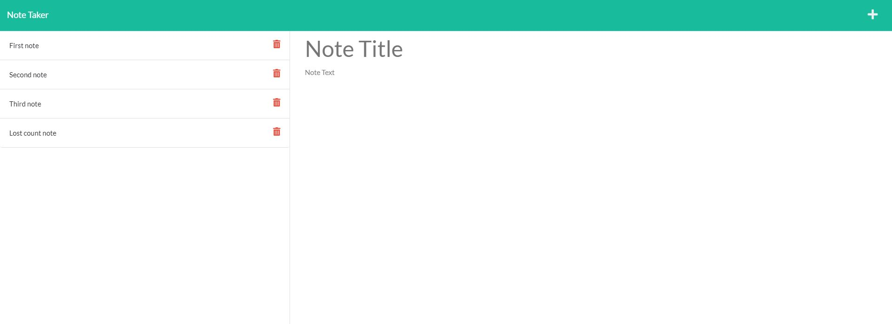

  <!-- PROJECT TITE -->
  <h1 align="center">Note Taker</h1>
  
  <!-- DESCRIPTION -->
  

  Application called Note Taker that can be used to write and save notes. This application uses an Express.js back end and saves and retrieves note data from a JSON file.

  <!-- DEPLOYED LINK -->
  Heroku: https://vert-fromage-04848.herokuapp.com/notes
  GitHub repository URL: https://github.com/SaidHadad/Challenge-11-Note-Taker

  <!-- TABLE OF CONTENTS -->
  

  
Table of Contents

  <ol>
  <li><a href="#about-the-project">About The Project</a></li>
  <li><a href="#built-with">Built With</a></li>
  <li>
    <a href="#getting-started">Getting Started</a>
    <ul>
    <li><a href="#prerequisites">Prerequisites</a></li>
    <li><a href="#installation">Installation</a></li>
    </ul>
    </li>
  <li><a href="#contributing">Contributing</a></li>
  <li><a href="#license">License</a></li>
  <li><a href="#contact">Contact</a></li>
  </ol>
  

  
  
  <!-- ABOUT THE PROJECT -->
  ## About The Project

    
  11th Challenge for the University of Toronto Coding Bootcamp
  
  ## Built With

   JavaScript, E6S, Node, Express
  
  <!-- GETTING STARTED -->
  
  ## Getting Started

  ### Prerequisites

  Node, node_modules, express.js

  ### Installation

  npm install --y  
  npm install express  
   
  In package.json add  
  "start": "node server.js" to scripts 
   
  start the server

  <!-- CONTRIBUTING -->
    
  <!-- LICENSE -->
  
  ## License

  MIT
  
  <!-- CONTACT -->
  
  ## Contact
  Name: Said David Hadad  
  Email: saiddavid.hadad@gmail.com  
  GIT: https://github.com/SaidHadad  